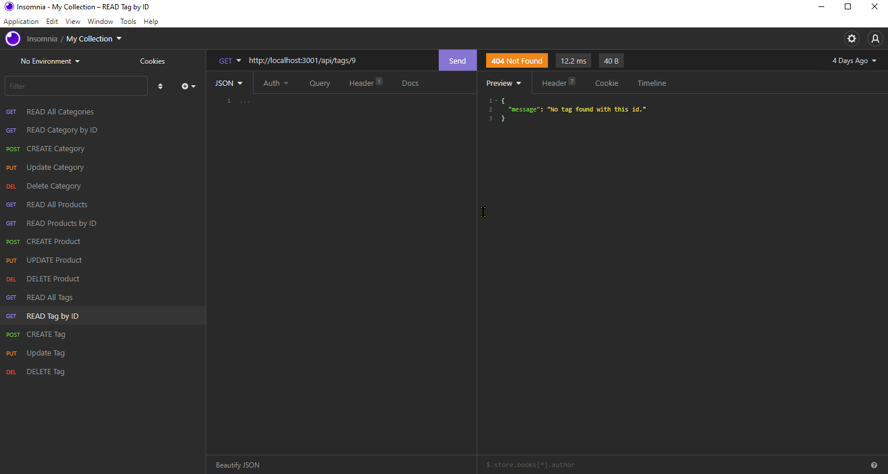

# Social Network API

## Description

An API for a social network web application where users can share their thoughts, react to friends’ thoughts, and create a friend list.

## Table of Contents

- [Deployment URL](#Deployment-URL)
- [Repo URL](#Repo-URL)
- [Features](#Features)
- [Installation](#Installation)
- [Usage](#Usage)
- [Technologies Used](#Technologies-Used)
- [Questions](#Questions)
- [License](#License)

### Deployment URL

This is a back-end (server-side) application. It is currently not deployed online.

### Repo URL

https://github.com/arslan-razi/social-network-api

## Features

1. NoSQL Database
1. REST API
1. Back-end (server-side) application.
1. Can handle large amounts of unstructured data.
1. Data responses are output in JSON format when requests are sent through API routes.

## Pre-requisites
1. Install `Node.js` on your local machine.
1. Install `MongoDB` on your local machine.
1. Install an API Client, such as `Insomnia Core` or `Postman`.

## Installation

1. Download or Clone this repository.
1. If you downloaded the zipped version of this repo, then unzip it in the desired directory.
1. Go to the command line (if you're not there already).
1. Change the directory to `social-network-api`.
1. Run: `npm install`. 
1. Install `express.js` and `mongoose.js`

## Usage

1. Go to the command line.
1. Navigate to the `social-network-api` directory.
1. Run `npm start`.
1. Open the API Client.
1. Start making API requests at `localhost:3001` followed by an API route from the [list below](#API-Routes).

### Optional

1. Open a `MongoDB` GUI, such as `MongoDB Compass`.
1. Connect to the database (db): `mongodb://localhost:social-network-api`.
1. Monitor the updates to the db in response to API requests.

### API Routes

1. `/api/users`
   1. `GET` all users
   1. `GET` a single user by its `_id` and populated thought and friend data
   1. `POST` a new user: 
      `// example data` 
      `{` 
      &nbsp;&nbsp;&nbsp;&nbsp;`"username": "scott",` 
      &nbsp;&nbsp;&nbsp;&nbsp;`"email": "scott@gmail.com"` 
      `}`
   1. `PUT` to update a user by its `_id`
   1. `DELETE` to remove a user by its `_id`
1. `/api/users/:userId/friends/:friendId`
   1. `POST` to add a new friend to a user's friend list
   1. `DELETE` to remove a friend from a user's friend list
1. `/api/thoughts`
   1. `GET` to get all thoughts
   1. `GET` to get a single thought by its `_id`
   1. `POST` to create a new thought (don't forget to push the created thought's `_id` to the associated user's `thoughts` array field) 
      `// example data` 
      `{` 
      &nbsp;&nbsp;&nbsp;&nbsp;`"thoughtText": "This is a though",` 
      &nbsp;&nbsp;&nbsp;&nbsp;`"username": "lernantino",` 
      &nbsp;&nbsp;&nbsp;&nbsp;`"userId": "5edff358a0fcb779aa7b118b"` 
      `}`
   1. `PUT` to update a thought by its `_id`
   1. `DELETE` to remove a thought by its `_id`
1. `/api/thoughts/:thoughtId/reactions`
   1. `POST` to create a reaction stored in a single thought's `reactions` array field
   1. `DELETE` to pull and remove a reaction by the reaction's `reactionId` value

### Screenshot / Gif Animation

### Video Demo

[Video Link](https://youtu.be/Q66Un6T30Go)

## Technologies Used

1. JavaScript
1. Node.js
1. Express.js
1. MongoDB
1. Mongoose.js

## Questions

Please send your questions and / or comments to **Arslan Razi** at arslan.razi@outlook.com, or contact me on [GitHub](https://github.com/arslan-razi).

## License

This project is licensed under the terms of the [MIT](https://opensource.org/licenses/MIT) license.
